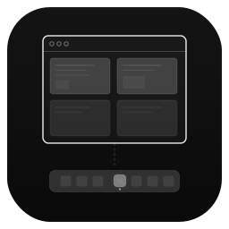
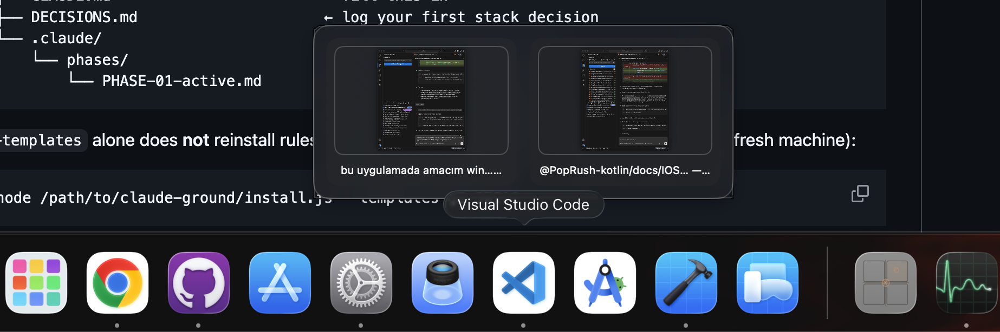
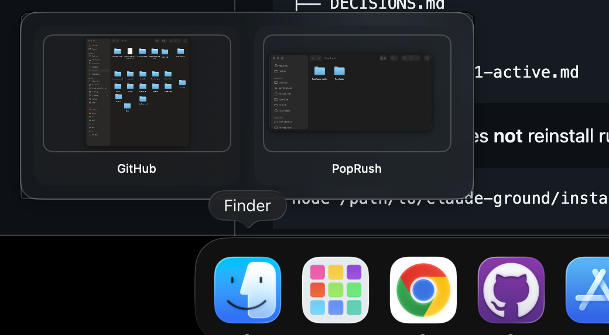
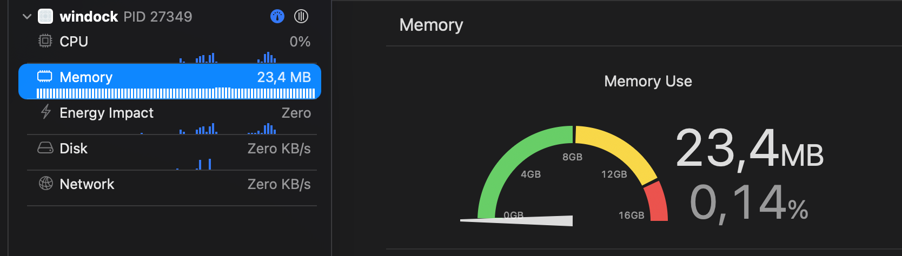
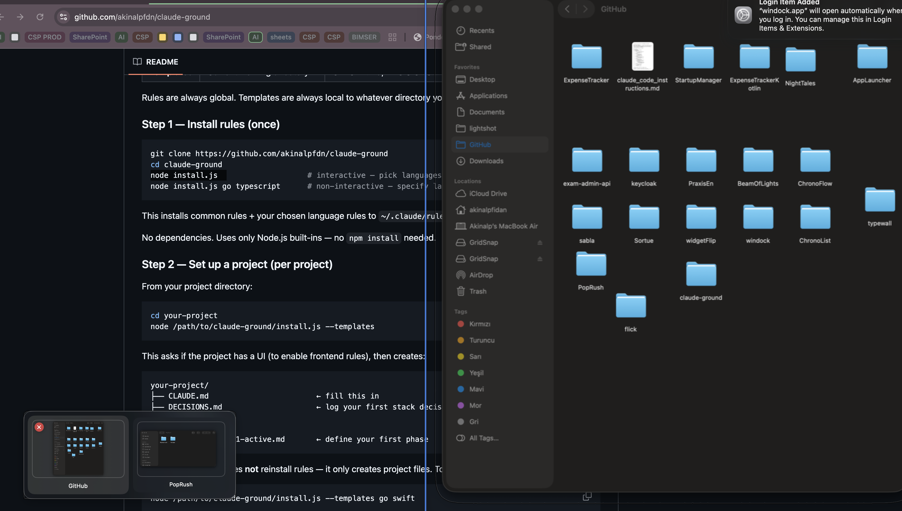

<p align="center">
  
</p>

<h1 align="center">WinDock</h1>

<p align="center">
  A lightweight extension for the native macOS Dock that adds Windows-style window previews.<br>
  No custom dock, no replacement — WinDock hooks into your existing Dock and enhances it.
</p>

<p align="center">
  <a href="https://github.com/akinalpfdn/windock/releases/latest/download/WinDock.dmg">
    
  </a>
</p>

<p align="center"><sub>macOS 14.0+ · Signed & Notarized</sub></p>

Hover over any dock icon to see live thumbnails of its open windows.


## Features

- **Native Dock extension** — Works directly with the macOS Dock, not a replacement
- **Dock hover previews** — Live window thumbnails appear above dock icons
- **Click to focus** — Click any preview to bring that specific window to front
- **Aero Peek** — Hover a preview card to see the window at its actual screen position
- **Close from preview** — Close windows directly from the preview panel
- **Launch at login** — Starts automatically and runs silently in the background





## Lightweight

WinDock uses ~23 MB of memory and 0% CPU when idle. No Electron, no web views — pure Swift and AppKit.



## How It Works

WinDock doesn't replace or redraw the Dock. It listens to the native macOS Dock process via the Accessibility API (`AXObserver`), detects which icon you're hovering, and shows a floating preview panel above it. Thumbnails are captured live using ScreenCaptureKit.



## Requirements

- macOS 14.0 or later
- **Accessibility permission** — Required to detect dock hover events
- **Screen Recording permission** — Required to capture window thumbnails

## Installation

1. Download the latest release from [Releases](../../releases)
2. Move `WinDock.app` to `/Applications`
3. Launch WinDock
4. Grant Accessibility and Screen Recording permissions when prompted

### Build from Source

```bash
git clone https://github.com/akinalpfidan/windock.git
cd windock
open windock.xcodeproj
```

Build and run with Xcode. Disable App Sandbox in Signing & Capabilities (required for Accessibility API access).

## Architecture

```
windock/
  Services/
    DockObserver       — AXObserver on macOS Dock process
    WindowManager      — AXUIElement window focus & close
    WindowCaptureService — ScreenCaptureKit thumbnails
  ViewModels/
    DockViewModel      — Coordinates hover, preview, and peek
  Views/
    Preview/
      PreviewPanel     — Floating NSPanel (non-activating)
      WindowPreviewList — SwiftUI preview cards
      WindowHighlightOverlay — Aero Peek overlay
  Models/
    DockModels         — WindowInfo, DockApp
```

## License

MIT
